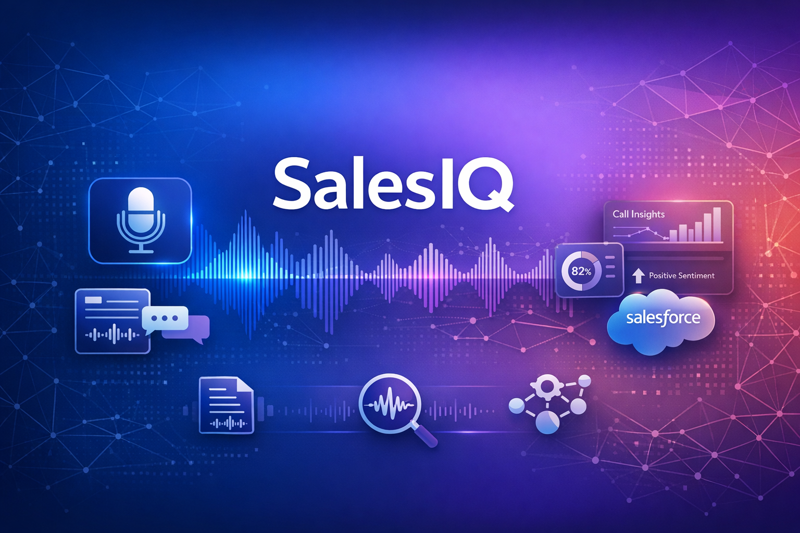

# SalesIQ - Sales Call Analysis Platform



## Overview

SalesIQ is an intelligent sales call transcription and analysis platform that transforms your sales conversations into actionable insights. Upload audio recordings of your sales calls, and our AI-powered system automatically transcribes the conversation, identifies key discussion points, extracts customer needs, and generates comprehensive action items. The platform seamlessly integrates with Salesforce, allowing you to instantly update account records with valuable customer intelligence gathered from each call. With speaker diarization capabilities, SalesIQ distinguishes between different speakers in the conversation, providing clear attribution for who said what during your sales interactions.

Built for modern sales teams, SalesIQ eliminates the tedious task of manual note-taking and CRM updates, enabling sales professionals to focus on what they do best—building relationships and closing deals. The platform's intuitive interface displays detailed call summaries, sentiment analysis, and next steps recommendations, while the direct Salesforce integration ensures that all customer insights are immediately available to your entire team. Whether you're conducting discovery calls, product demos, or follow-up meetings, SalesIQ captures every important detail and transforms your sales conversations into a strategic asset that drives revenue growth and improves customer relationships.

## 🚀 Key Features

- 🎙️ **Automatic Transcription** - Convert sales call recordings to text with high accuracy
- 👥 **Speaker Diarization** - Identify and separate different speakers in the conversation
- 🧠 **AI-Powered Analysis** - Extract key points, customer needs, and action items automatically
- 📊 **Call Summaries** - Get concise overviews of lengthy sales conversations
- 🔗 **Salesforce Integration** - Update account records directly from call insights
- 📝 **Action Items** - Never miss a follow-up with automatically generated tasks
- 💡 **Customer Needs Identification** - Understand what your customers truly want
- 🎯 **Next Steps Recommendations** - Get AI-suggested actions to move deals forward
- 📈 **Sales Intelligence** - Build a knowledge base of customer interactions
- ⚡ **Fast Processing** - Get results in minutes, not hours

## 🎯 Use Cases

- **Sales Discovery Calls** - Capture requirements and pain points
- **Product Demonstrations** - Document feature discussions and objections
- **Customer Check-ins** - Track relationship progress and satisfaction
- **Negotiation Meetings** - Record terms, conditions, and agreements
- **Team Training** - Review and learn from successful sales calls
- **CRM Enrichment** - Keep Salesforce records up-to-date automatically

## 🛠️ Technology Stack

- **Backend**: Python 3.11, Flask
- **AI/ML**: OpenAI API for transcription and analysis
- **CRM Integration**: Salesforce MCP (Model Context Protocol)
- **Frontend**: Vanilla JavaScript, HTML5, CSS3
- **Audio Processing**: FFmpeg, Pydub
- **Document Processing**: Poppler, wkhtmltopdf

## 📋 Prerequisites

- Python 3.11 or higher
- OpenAI API key
- Salesforce account with MCP configured
- FFmpeg installed on system

## 🚀 Getting Started

### Installation

1. Clone the repository:
```bash
git clone https://github.com/NinjaTech-AI/agent-salesforce-transcriber.git
cd agent-salesforce-transcriber
```

2. Install dependencies:
```bash
pip install -r requirements.txt
```

3. Configure your API key in the application files:
   - Update `app.py`, `diarization_app.py`, and `real_transcribe.py` with your OpenAI API key

4. Ensure Salesforce MCP is running:
```bash
mcp-tools services
# Should show: salesforce: http://localhost:9082/mcp
```

### Running the Application

```bash
python app.py
```

The application will be available at `http://localhost:9000`

## 📖 Usage

1. **Upload Audio**: Click "Upload Audio" and select your sales call recording
2. **Transcribe**: The system automatically transcribes and analyzes the call
3. **Review Analysis**: View the call summary, key points, customer needs, and action items
4. **Select Account**: Choose the relevant Salesforce account from the dropdown
5. **Update Salesforce**: Click "Update Account" to save customer insights to Salesforce

## 🔧 Configuration

### API Keys

Update the following files with your OpenAI API key:
- `app.py`
- `diarization_app.py`
- `real_transcribe.py`

### Salesforce Integration

The application uses Salesforce MCP for CRM integration. Ensure your MCP server is configured and running on `localhost:9082`.

## 📁 Project Structure

```
agent-salesforce-transcriber/
├── app.py                          # Main Flask application
├── diarization_app.py              # Speaker diarization logic
├── real_transcribe.py              # Transcription processing
├── static/
│   ├── css/
│   │   └── styles.css             # Application styles
│   ├── js/
│   │   └── app.js                 # Frontend JavaScript
│   └── images/
│       └── salesiq-cover.png      # Cover image
├── templates/
│   └── index.html                 # Main HTML template
├── media_library/                  # Uploaded audio files
├── reports/                        # Generated analysis reports
├── requirements.txt                # Python dependencies
├── APPLICATION_DESCRIPTION.md      # Detailed description
├── MEETING_LOGGING.md             # Meeting logging documentation
└── README.md                       # This file
```

## 🐛 Troubleshooting

### Common Issues

**Port Already in Use**
```bash
# Kill process on port 9000
fuser -k 9000/tcp
```

**Salesforce MCP Not Connected**
```bash
# Check MCP status
mcp-tools services

# Test Salesforce connection
mcp-tools call salesforce_get_accounts '{"limit": 1}'
```

**Transcription Errors**
- Verify OpenAI API key is correct
- Check audio file format (supported: mp3, mp4, wav, webm)
- Ensure file size is under 25MB

## 🤝 Contributing

Contributions are welcome! Please feel free to submit a Pull Request.

## 📄 License

This project is proprietary software developed by NinjaTech AI.

## 🔗 Links

- **Live Demo**: https://00104.app.super.betamyninja.ai
- **GitHub Repository**: https://github.com/NinjaTech-AI/agent-salesforce-transcriber
- **NinjaTech AI**: https://www.ninjatech.ai

## 📞 Support

For support, please contact the NinjaTech AI team or open an issue on GitHub.

---

Built with ❤️ by [NinjaTech AI](https://www.ninjatech.ai)